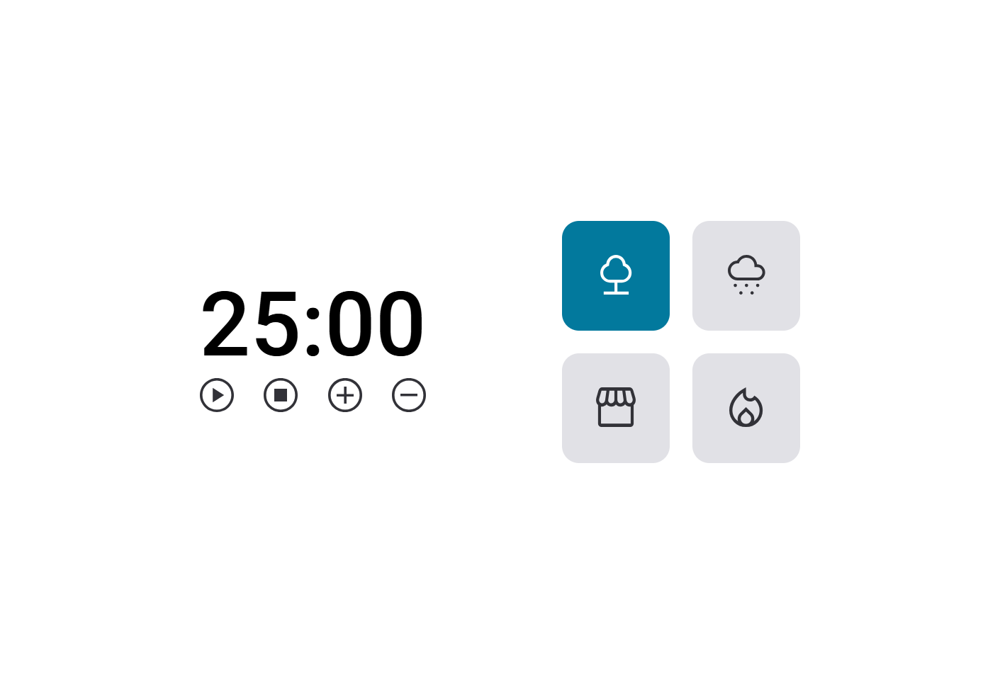

# FOCUS TIMER 2.0

Explorer da Rocketseat

Projeto construído no Stage 05 do Explorer da Rocketseat

<!-- [🔗 Clique aqui para acessar](https://pdiacov.github.io/jogo-da-adivinhacao/) -->

## Índice
- [Tecnologias](#tecnologias)
- [Projeto](#projeto)
- [Contato](#contato)

## Tecnologias
- HTML
- CSS
- JavaScript
## Projeto
O FocusTumer é um Timer desenvolvido em Javascript com possibilidade de aumentar ou diminuir os minutos e pode também colocar um som de fundo. O som pode ser de floresta, chuva, cafeteria ou fogueira.

Aplicação:

- Estrutura de dados HTML
- Funções no Javascript
- Manipulação da DOM
- Estruturas de repetição
- Funções *callback*

## Contato

- pdiacov@gmail.com

- https://www.linkedin.com/in/pdiacov/

- https://www.instagram.com/paulodiacov/

Faça parte da [comunidade da Rocketseat!](https://rocketforms.typeform.com/to/fPcSmBp9#referral_id=a371700f-bdda-45cf-8164-a9692dff3ebb)
